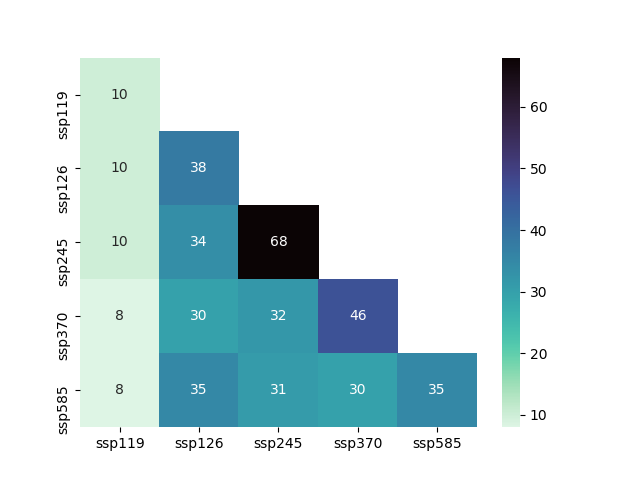

CMIP6 input data for CORDEX
===========================

Parse ESGF metadata to discover CMIP6 model runs meeting the criteria for
downscaling. In table [CMIP6_for_CORDEX_Summary.csv](./CMIP6_for_CORDEX_Summary.csv),
each model run and scenario is tagged according to the availability of 
enough variables to drive a Regional Climate Model (**RCM**), to provide typical
predictors for Empirical-Statistical Downscaling (**ESD**) or for **Basic**
analyses (currenly meaning that daily precipitation and near-surface mean
temperature are available)

Usage
-----

```
python3 CMIP6_for_CORDEX.py
```

Does the search and builds a csv table ([CMIP6_for_CORDEX_Summary.csv](./CMIP6_for_CORDEX_Summary.csv)) tagging each
simulation depending on the variables available in ESGF.

```
python3 scenario_stats.py
```

Performs cross-scenario availability statistics. See `scenario_stats.txt` for
two- and three-scenario stats.


